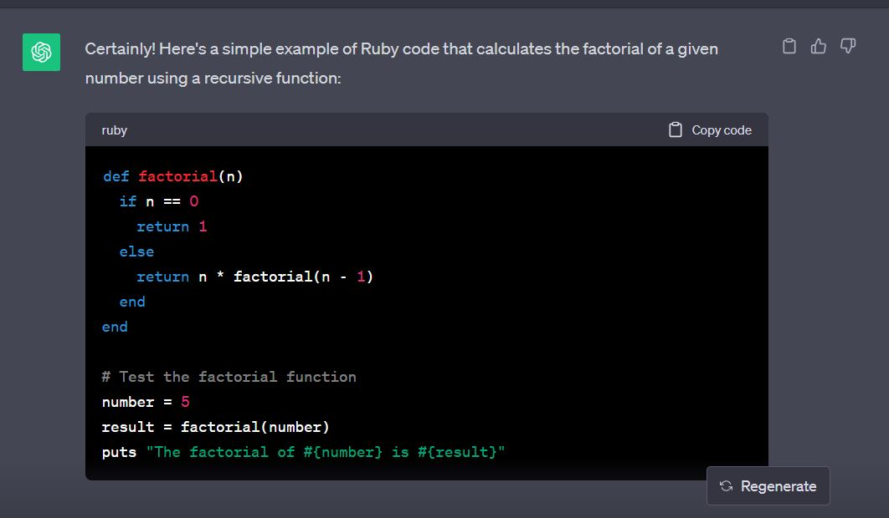
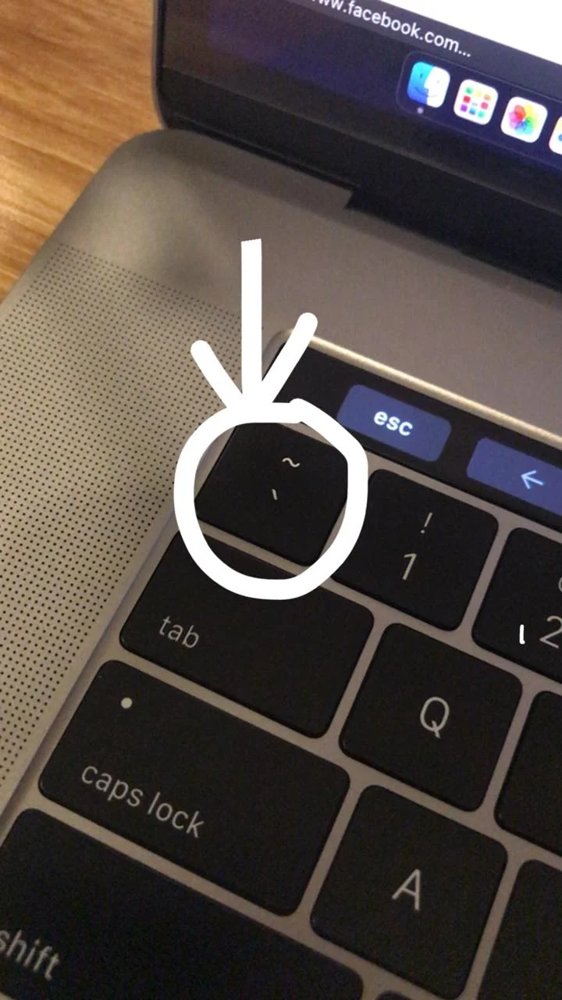
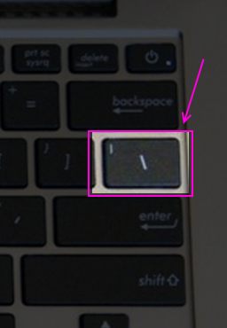

# Writing Good Documentation

## Step 1 - Using Codeblocks.

Codeblocks in markdown make it *very easy* for tech people to **copy, paste, share** code.
A good __Cloud Engineer__ uses Codeblocks whenever possible.

Because it allows other to copy and paste their code to replicate or research issues.

- In order to create codeblocks in markdown you need to use three backticks (`).
- Not to be confused with quotations (').

```
def factorial(n)
  if n == 0
    return 1
  else
    return n * factorial(n - 1)
  end
end

# Test the factorial function
number = 5
result = factorial(number)
puts "The factorial of #{number} is #{result}"
```

- When you can you should attempt to apply syntax highlighting to your codeblocks.

```ruby
def factorial(n)
  if n == 0
    return 1
  else
    return n * factorial(n - 1)
  end
end

# Test the factorial function
number = 5
result = factorial(number)
puts "The factorial of #{number} is #{result}"
```
- With markdown, cannot resize an image


- With html image resized


Good Cloud Engineers use codeblocks for both Code and Errors that appears in the console.

```bash
Traceback (most recent call last):
  File "<stdin>", line 1, in <module>
NameError: undefined local variable or method `undefined_variable' for main:Object
```
> Here is an example of using a codeblock for an error that appears in bash.

When you can always provide a codeblock instead of a screenshot.
If you need to take a sreenshot make sure it isn't a photo from your phone.

> There are certain cases where it's oaky to take photos with your phone. This is when you are showing something like a keyboard, which does not appear on a computer screen. If it render on your computer screen it should be a screenshot.

## Step 2 - How to take screenshots 

A screenshot is when you capture a part of your screen from your laptop, desktop or phone.

This is not be confused with take a photo with your phone.

**DON'T DO THIS**


This is what a screenshot should look like.



**DO THIS INSTEAD**

Taking screenshots on both Mac and Windows is relatively straightforward. Here are the common methods for taking screenshots on each platform:

**On Mac (macOS):**

1. **Entire Screen:**
   - Press `Command (⌘) + Shift + 3`. This captures the entire screen, and the screenshot will be saved as a file on your desktop by default.

2. **Selected Area:**
   - Press `Command (⌘) + Shift + 4`. This allows you to select a specific area of the screen for the screenshot. Click and drag to select the area, and the screenshot will be saved as a file on your desktop.

3. **Specific Window:**
   - Press `Command (⌘) + Shift + 4`, then press `Spacebar`. This allows you to capture a specific window. Click the window you want to capture, and the screenshot will be saved as a file on your desktop.

4. **Screenshot to Clipboard:**
   - To copy the screenshot to your clipboard instead of saving it as a file, add the `Control (⌃)` key to any of the above shortcuts. For example, `Command (⌘) + Control (⌃) + Shift + 3` to copy the entire screen to the clipboard.

**On Windows:**

1. **Entire Screen:**
   - Press `PrtScn` (Print Screen) key. This captures the entire screen to the clipboard.

2. **Active Window:**
   - Press `Alt + PrtScn`. This captures only the currently active window to the clipboard.

3. **Selected Area: (Windows 10 and later)**
   - Press `Shift + Windows Key + S`. This allows you to select a specific area of the screen for the screenshot. After selecting the area, the screenshot is copied to the clipboard, and you can paste it into an application like Paint or Word.

4. **Using Snipping Tool: (Windows 7 and later)**
   - Search for "Snipping Tool" in the Start menu and open it. You can then use the Snipping Tool to capture specific areas of the screen and annotate or save the screenshot.

5. **Using Snip & Sketch: (Windows 10 and later)**
   - Search for "Snip & Sketch" in the Start menu and open it. This tool allows you to capture, annotate, and save or share screenshots.

After taking a screenshot on Windows, you can paste it into an image editing program like Paint or an application like Microsoft Word to save or edit it.

Keep in mind that the exact methods and shortcuts may vary slightly depending on the version of macOS or Windows you are using, but these are the most common methods for taking screenshots on both platforms.

## Step 3 - Use Github Flavoured Markdown Task Lists

Github extends Markdown to have a list where you can check off items. [<sup>[1]</sup>](#references)

- [x] Finish Step 1
- [ ] Finish Step 2
- [x] Finish Step 3

## Step 4 - Use Emojis (Optional)

GitHub Flavored Markdown (GFM) supports emojis shortcodes.
Here are some examples:

| Name | Shortcode | Emoji |
| --- | --- | --- |
| Cloud | `:cloud:` | ☁️ |
| Cloud with lighting | `:cloud_with_lightning:` | 🌩️|

☁️ :cloud:

## Step 5 - how to create a table

You can use the following markdown format to create tables:

~~~md
| Name | Shortcode | Emoji |
| --- | --- | --- |
| Cloud | `:cloud:` | ☁️ |
| Cloud with lighting | `:cloud_with_lightning:` | 🌩️|
~~~
Github extends the functionality of Markdown tables to provide more alignment and table cell formatting options.[<sup>[2]</sup>](#references)

- Make note of where the backtick key is located.
- It should appear above the tab key,
- but it may vary based on your keyboard layout.



- Make note of where the pipe key is located.
- It should appear above the enter or return key,
- but it may vary based on your keyboard layout.
  


[Secret window Hidden Garden](secret-window/hidden-garden.md)

## References

- [GitHub Flavored Markdown Spec](https://github.github.com/gfm/)
- [Basic writing and formatting syntax(Github Markdown)](https://docs.github.com/en/get-started/writing-on-github/getting-started-with-writing-and-formatting-on-github/basic-writing-and-formatting-syntax#quoting-text)
- [GFM - Task Lists](https://docs.github.com/en/get-started/writing-on-github/getting-started-with-writing-and-formatting-on-github/basic-writing-and-formatting-syntax#task-lists) <sup>[1]</sup>
- [GFM - Emoji Cheatsheet](https://github.com/ikatyang/emoji-cheat-sheet)
- [GFM - Tables (with extensions) ](https://github.github.com/gfm/#tables-extension-). <sup>[2]</sup>
